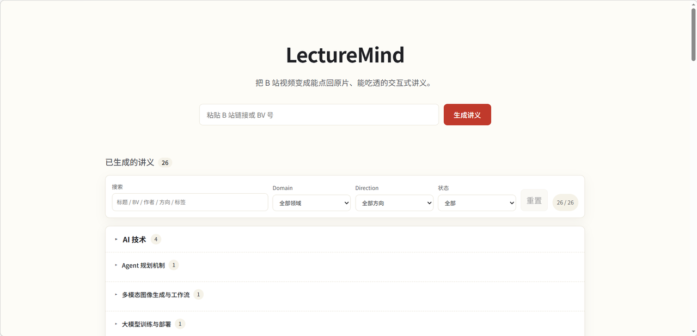
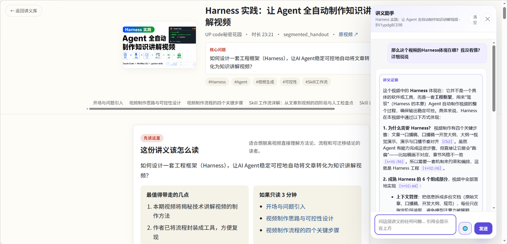

# LectureMind

> **一条 B 站视频 → 一份可阅读、可追溯、可对话的结构化讲义。** 配套页面内 Copilot 问答与 MCP 协议，把视频知识变成可被任何 Agent 消费的资产。

[](./LICENSE)
[](./pyproject.toml)
[](#工程质量)
[](#)

---

## 效果展示

讲义库与一键总结入口：



生成后的讲义正文与页面内问答：



---

## 它能做什么

### 1. 视频 → 结构化讲义

输入一个 B 站视频链接，Pipeline 自动完成：

```
元数据 → 字幕 + 关键帧 + 封面（并行）→ VLM 视觉理解 → 多 Agent 生成讲义
→ 双投影编译（讲义结构 + 证据索引）→ HTML 渲染 → RAG 索引
```

### 2. 多 Agent 协作

讲义生成不是单次 LLM 调用，而是 4 个 Agent 分工、各自带失败降级：

| Agent | 职责 | 失败策略 |
| --- | --- | --- |
| StudyQuestionAgent | 生成学习问题驱动抽取 | 失败 → 跳过 |
| LectureIRBuilder | 结构化抽取（单次 / Map-Reduce） | 截断 → 自动降级 |
| Critic | 质量审查（覆盖度 / 引用 / 代码公式） | 失败 → 跳过 |
| Reviser | 定向修复（patch / full） | 失败 → 保留原 IR |

### 3. 长度感知路由

按视频时长自动选策略，长视频不会「一把梭」：

| Profile | 时长 | IR Build | Critic | Reviser |
| --- | --- | --- | --- | --- |
| tiny | < 3min | 单次 | off | off |
| standard | 3–15min | 单次 | full | off |
| long | 15–60min | Map-Reduce | projected | patch |
| epic | 60min+ | Map-Reduce | projected | patch |

### 4. 讲义内 Copilot

基于 **LangGraph ReAct** 的问答 Agent：

- 混合检索（向量 + FTS5 → RRF 融合），8 种知识块类型
- 锚点验证：自动校验时间戳 / 帧号 / 章节号有效性
- 回答分段标签（`[[evidence]]` / `[[background]]` / `[[deep_dive]]`）

### 5. MCP Server

通过 MCP 协议暴露 **11 个只读工具**给外部 Agent（Cursor / Claude Desktop / ChatGPT Apps）：

- stdio（本地）/ HTTP+SSE（远程）两种接入方式
- `summarize_video` 默认隐藏，需显式开启

---

## 快速开始

```bash
cp .env.example .env          # 填 DEEPSEEK_API_KEY / DASHSCOPE_API_KEY 等
pip install -e ".[whisper]"
python -m scripts.init_db
python -m app.main            # 启动 FastAPI 服务
```

启动后浏览器访问 **`http://127.0.0.1:8000`**（`0.0.0.0` 是服务监听地址，浏览器访问不到）。

命令行处理单条视频：

```bash
python -m scripts.run_pipeline https://www.bilibili.com/video/BVxxxxxxxxxx
```

启动 MCP Server：

```bash
python -m scripts.run_mcp_server                        # stdio
python -m scripts.run_mcp_server --sse --port 8111      # HTTP+SSE
```

Docker 一键：`docker compose up -d --build`

---

## 设计亮点

### 双投影设计

讲义中间表示（LectureIR）编译为两个独立投影：

- **Lecture Note IR**：面向读者（教学单元 / 内容块 / 视觉位）
- **Evidence Index**：面向系统（证据对象 / 关系 / 锚点）

两者双向关联，**HTML 只是投影结果，不是数据源**——同一份知识底座可支撑渲染、问答、外部 Agent 三种消费。

### Runtime Harness

每次运行都有统一运行契约：`RunContract（要做什么）+ PolicySnapshot（允许什么）= RunRecord（运行记录）`，产出带 `verdict`（accept / revise / block + 原因 + 证据引用）。

### 10+ 层容错

设计哲学是「假设 LLM 的每一次输出都可能出问题」：采集回退（httpx→curl、CC→Whisper）、截断降级（单次→Map-Reduce）、Agent 失败 no-op、Reviser 修改白名单 + 整批回滚、坏快照保留上一份……

---

## 工程质量

- **测试**：28 个测试文件，覆盖 Pipeline / Runtime Harness / Copilot / MCP / 编译检查，CI 矩阵（Python 3.10 / 3.11 + ffmpeg + compileall）
- **工程化**：`AGENTS.md` / `CLAUDE.md` / `ARCHITECTURE.md` 即仓库规范，Agent 冷启动读入口文件即可上手
- **配置**：200+ 配置项（.env），模型栈 / Agent / 路由 / 容错 / VLM / Copilot / MCP 全可调

---

## 技术栈

| 层 | 技术 |
| --- | --- |
| Agent 框架 | LangGraph（ReAct） |
| 文本生成 + Copilot | DeepSeek（OpenAI 兼容） |
| 视觉理解 / Embedding | DashScope（Qwen VL / embedding） |
| MCP | FastMCP |
| RAG | sqlite-vec（向量）+ FTS5（全文）→ RRF 融合 |
| Web | FastAPI + Uvicorn |
| 渲染 | Jinja2 + KaTeX + highlight.js |
| 采集 | bilibili-api / yt-dlp / PySceneDetect / ffmpeg / faster-whisper |

---

## 项目目录

```
app/
  main.py / api.py        Web 入口与路由
  pipeline.py             端到端编排（8 阶段）
  ingest/                原料采集（字幕 / 关键帧 / 封面）
  understand/            理解层（IR / Agents / VLM / 编译器 / 证据索引）
  render/                渲染层（HTML + KaTeX）
  copilot/               消费层（Agent / RAG / Tools / MCP）
  runtime/               运行时 Harness（contracts / policy / observe）
scripts/                 CLI 工具（25+ 脚本）
tests/                   测试套件（28 文件）
docs/                    设计文档与展示截图
```

## License

[MIT](./LICENSE)
